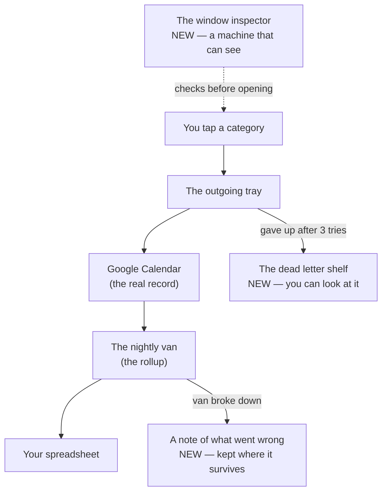
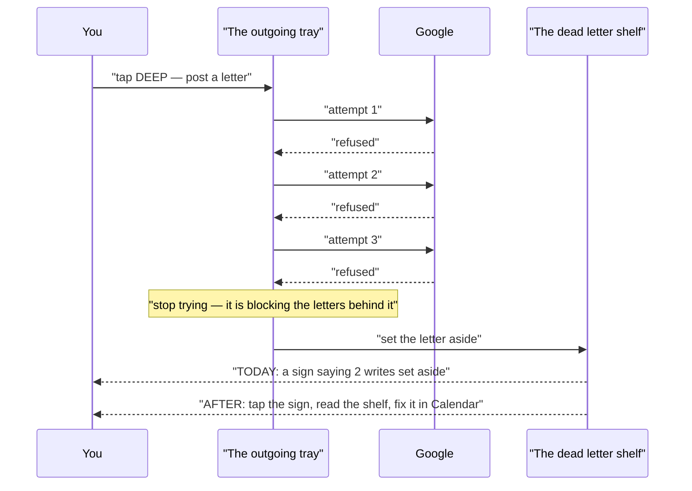
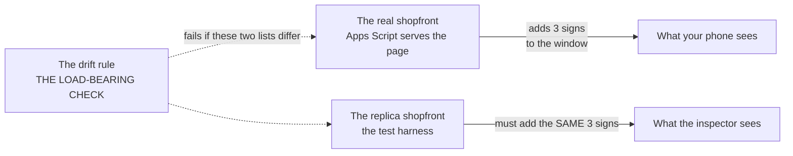
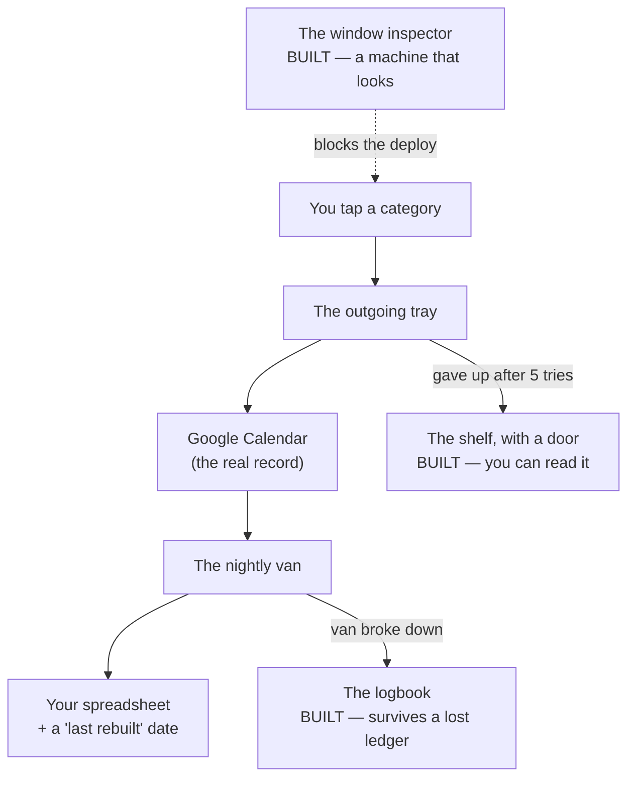
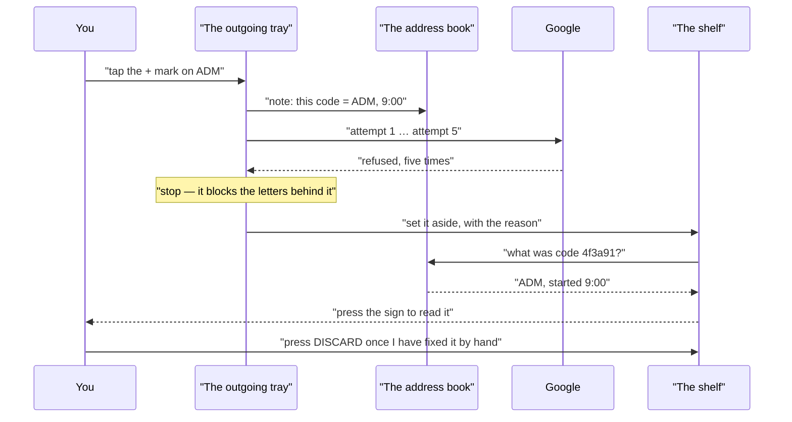
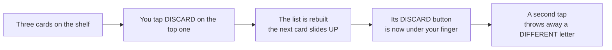
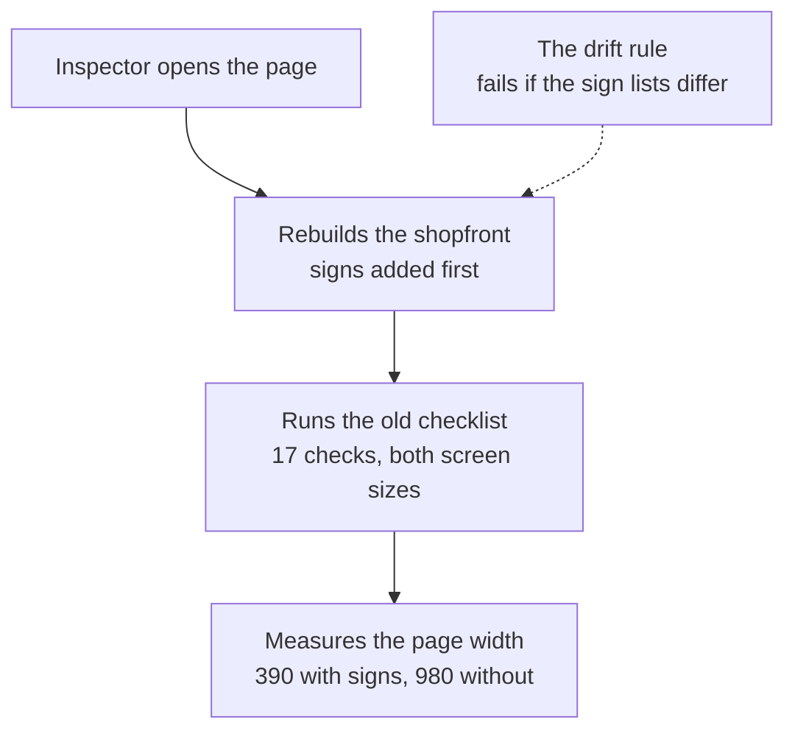

# timetap — the plain-language owner's manual

Written as we go, one section per checkpoint. Pictures first, analogies always,
no jargon that isn't explained in the same sentence.

---

# Part 1 — The plan, explained

## What we're about to build
*2026-07-26 — before any code is written*

### The whole thing in one picture

The scene for this whole explanation is **a small post office**. Every tap you
make in the app is a letter you're posting. Keep that one picture in your head
and everything below fits into it.



Three of those boxes are new. Everything else already exists and works.

### The cast of characters

**You tap a category** — the front counter. This is the app on your phone,
[Index.html](../Index.html). Nothing about this changes in this round. Tapping
still opens a block, the next tap still closes it, the mark still appears.

**The outgoing tray** — where a letter waits to be delivered. When you tap, the
screen updates immediately and the actual write to Google happens a moment later
in the background. If Google can't be reached, the letter waits in the tray and
gets tried again. This is the "queue" in [Index.html:408](../Index.html:408), and
it already works well.

**Google Calendar** — the ledger of record. Not a copy, not a backup: *the*
record. Your phone's memory is just a tray of letters on their way there. This is
why the app survives a dead battery — on startup it asks the calendar what's open
rather than trusting the phone.

**The dead letter shelf** *(new — Stage B)* — where undeliverable mail goes.
Today, a letter that fails three times is taken out of the tray and put somewhere
you cannot see, and a sign appears saying "2 writes were set aside"
([Index.html:964](../Index.html:964)). That's the whole story you currently get.
We're turning that hidden pile into a shelf you can walk over to and read: when,
which category, what it was trying to do, and why it failed.

**The nightly van** *(gets a repair — Stage C)* — the rollup, a job that runs once
a day, reads the calendars, and rewrites two tabs of your spreadsheet
([Code.gs:817](../Code.gs:817)). You read those on Sunday. Today, if the van
breaks down, nobody tells you and nothing looks different — the spreadsheet just
quietly holds last week's numbers.

**A note of what went wrong** *(new — Stage C)* — the van's logbook. Two parts:
the van writes today's date onto the ledger every time it makes a delivery, and it
keeps a private note of any breakdown somewhere that survives even when it can't
reach the ledger at all.

**The window inspector** *(new — Stage D)* — someone who checks the shopfront
looks right before opening. Right now the only person who can do that is you,
walking past with your own eyes: [test/smoke.js](../test/smoke.js) is a file you
paste into a browser by hand, on your phone. It catches things nothing else can —
text laid on top of other text, the page being taller than the screen — but only
if a human does it. We're hiring a machine that can look.

### Follow one letter through the system

The spine of this round is the story of a letter that never arrives. Here's what
happens today, and what will happen after.



The key moment is the one labelled *stop trying*. The tray delivers letters in
order, so a letter that can't go anywhere blocks every letter behind it. Setting
it aside is the right call — that part already works and we're not touching it.
The problem is purely that the shelf has no door.

**Why there's no "try again" button.** This surprised me while reading the code,
and it's the most interesting decision in the round. By the time a letter reaches
the shelf, it sat at the front of the tray while every letter behind it went
through. So the world has moved on: if the failed letter was the one saying *"open
a DEEP block at 2:15"*, then the later letter saying *"close that block at 3:40"*
already went out and referred to a block that never existed. Posting the first
letter now, out of order, wouldn't repair anything — it would be the app guessing
what you meant. Your calendar is right there and you can fix it in ten seconds by
hand. The shelf's job is to tell you *where to look*, which is the one thing you
currently can't find out.

### The window inspector, and the one thing that could make it a lie



Here's the wrinkle. When Google serves your app, it doesn't just hand over
[Index.html](../Index.html) — it adds three instructions to the page on the way out
([Code.gs:176](../Code.gs:176)), one of which is what tells a phone how wide the
screen is. Those instructions aren't in the file. They're added in transit.

So an inspector looking at the file on disk is looking at a page your phone never
receives. The fix is to have the replica add the same three instructions before the
inspector looks.

Which creates the real danger: **the day someone changes the three signs in the
real shopfront and forgets the replica.** From then on the inspector is checking a
building that doesn't exist, and passing it, and everyone feels safe. That's what
the drift rule is for — one check whose entire job is to fail the moment those two
lists stop matching. It's marked the highest-risk task in the plan
([D4](PLAN.md)), not because it's hard, but because a check like that is very easy
to write in a way that can never fail, and a check that can never fail is worse
than no check at all — because it gets counted.

### The parts most likely to confuse you

**1. Almost none of this code ever runs.** Every feature in this round lives on
what's called an error path — code that only wakes up after something has already
gone wrong. You could use the app happily for a month and never see the shelf, the
van's logbook, or the inspector's report. That's what makes it dangerous to build:
normal use won't reveal a mistake. It's also exactly why the next stage
(`factory-tests`) will deliberately break things — a Google that always refuses, a
spreadsheet that can't be opened, two tag lists knocked out of sync — rather than
watching it work and assuming the rest.

**2. The machine inspector does not replace you with your phone.** A headless
browser on a Mac is not an iPhone. Two of the three bug classes
[test/smoke.js](../test/smoke.js) was written for *only ever appeared on the
phone*. The paste-into-your-phone step stays in the instructions, unchanged, and
the plan explicitly forbids deleting it.

**3. "No dependencies" stops being strictly true, and we say so.** The app's
README opens by boasting that it has no dependencies — nothing borrowed from
anyone else. The inspector needs a borrowed browser. That borrowed thing never
touches the four files that run on your phone; it only ever runs on your Mac,
before a deploy. But the sentence in the README would quietly become false, so
there's a task at the end of the plan ([E1](PLAN.md)) to restate it honestly
rather than leave a boast that's aged badly.

### What you can now say

Three sentences that are accurate, if you ever need to explain this round to
someone technical:

1. "Every feature in this round is on an error path, so the tests have to force
   the failures — a server that always rejects, a sheet that won't open, a
   deliberately desynchronised tag list — rather than observe the happy path."
2. "The dead-letter drawer deliberately has no retry, because a quarantined
   operation sat at the head of an ordered queue while everything behind it
   proceeded, so replaying it out of order would be inference, not recovery."
3. "The headless smoke test renders locally, which is only honest because a lint
   rule fails the moment the harness's injected meta tags drift from the ones
   `doGet` actually serves."

---

# Part 2 — What got built, explained

## How the error paths actually work now
*2026-07-27 — after the build and after the independent review*

Same post office. Same letters. Three of the boxes from Part 1 were sketches;
they're now real rooms you can walk into, and I've been inside all three.

### The whole thing in one picture



Everything in Part 1's picture got built. One number changed: a letter is tried
**five** times, not three — I'd guessed three from reading, and the code says five
([Index.html:490](../Index.html:490)). Nobody changed it; the plan's sketch was
just slightly wrong about a detail that was already there.

### The cast, now that they're real

**The shelf got a door.** The sign on the counter ("2 writes were set aside") is
now something you can press. Pressing it opens a full-screen list, newest at the
top, one card per undeliverable letter. Each card says four things in ordinary
words:

```
9:53 AM · ADM
tried to save the mark, block started 9:00 AM
API call to calendar.events.patch failed with error: Not Found
[ DISCARD ]
```

That middle line is the part that took real work. A letter in the tray doesn't
naturally know which block it belonged to — a letter saying *"save the mark"*
carries only a reference code, which is useless to you standing in front of Google
Calendar. So the app now keeps a small **address book** on the side
([Index.html:451](../Index.html:451)): every time a letter is posted, if it knows
its category or its block's start time, it writes that down under the reference
code. Later, when a letter lands on the shelf, the shelf looks the code up in the
address book and can tell you *"the ADM block that started at 9:00"* instead of
*"reference 4f3a91"*.

Two bugs were caught during the build, both real, both fixed:

- **The sign used to erase itself.** It appeared at startup, then the app finished
  loading normally and wiped it on the way past — so the one message you needed
  was visible only when the load *also* failed. Now "hide the sign" checks whether
  anything is still on the shelf first, and refuses if there is
  ([Index.html:688](../Index.html:688)).
- **It said "1 write were set aside."** Now it says *was*.

**The van writes the date on the ledger.** Every successful nightly run stamps
`last rebuilt 2026-07-27 03:00 America/Chicago` into both spreadsheet tabs. The
placement is the interesting bit: the stamp goes in **row 1, in the first empty
column after your data** — deliberately not a new row at the top. If it were a new
row, every formula you've ever pointed at those tabs would silently shift by one.
A stamp that breaks your spreadsheet to tell you the spreadsheet is fresh would be
a poor trade.

**The van keeps a private logbook.** If the van can't reach the ledger at all — a
revoked spreadsheet, a wrong ID — it can't write a note *in* the ledger. So the
note goes somewhere else entirely: a Google-side scratchpad called a script
property, which stays writable even when the spreadsheet doesn't
([Code.gs:840](../Code.gs:840)). It records the last success and the last failure
**separately**, so a breakdown never erases the evidence of the last good run —
knowing the numbers went stale eleven days ago is the whole point. And there's a
button you can press in the editor, `rollupStatus()`, that reads it out in
sentences.

Critically: the van **writes the note and then still crashes** on purpose. If it
swallowed the error to look tidy, Google's own list of runs would show a success.

**The inspector was hired, and turned out to be half-blind — which is the most
useful thing we learned.** More on that below.

### Follow one failed letter, all the way through



I ran exactly this by hand, in a real browser, with the server forced to refuse.
It works. The card reads the way it should, the reason is Google's own words rather
than a code, and a letter written by an older version of the app — one with no
address book entry — renders as *"unknown category"* instead of a blank line or a
crash.

### The one thing that is broken, in plain words

The review found a real bug and it is the reason the build isn't finished.



That's it. That's the whole bug. Tap DISCARD twice quickly — the way anyone taps a
button on a phone — and you destroy two letters instead of one, and the second one
is a letter you never looked at. There's no undo, and the shelf is the *only*
record that letter ever existed.

**Why the tests said this was fine.** There is a test named "discard invoked twice
on the same row is a no-op", and it passes. Here's the gap. Most of the tests run
in a pretend browser — fast, no windows, good enough for logic. In the pretend
browser, "tap the same button twice" means literally the same button object, and
the app *does* correctly refuse the second tap: each card carries a little
fingerprint, and once a card is gone its fingerprint matches nothing. That guard is
real and it works.

But in a **real** browser the whole list is thrown away and redrawn after a
discard. The button you tap the second time isn't the same button — it's the next
card's button, sitting in the same place on the glass, carrying a *valid*
fingerprint. So the app does exactly what it was asked: it discards that card.

The pretend browser cannot express "a different control moved under your finger."
That's a category of bug it is structurally blind to — and it is precisely the
category the new inspector was hired to catch, except the inspector only runs the
old shopfront checklist, which has nothing about the shelf on it.

The fix is small: when a card is discarded, remove just that one card instead of
redrawing the list. Then nothing moves under your finger.

### The inspector's honest limits



The inspector works, and the drift rule works — I changed a sign on one side only,
in four different ways, and it failed every time and named the sign. I also
replaced the rule with one that always says "fine" and confirmed that three of its
own tests immediately stopped catching anything. So it isn't decorative.

But here's what the build discovered, and this is genuinely valuable: **the old
checklist cannot see screen width at all.** Every check on it is *relative* — is
the page as tall as the window, are the cells equal width, is the last row full —
and all of those are just as true on a 980-pixel-wide page as a 390-pixel one. I
verified this myself: strip out the width instruction entirely, so the page lays
out completely wrong, and all 17 checks still pass, cheerfully.

So the plan asked for a proof it couldn't have: *"remove the signs and watch the
checks fail."* They don't fail. Instead of quietly rewriting that requirement to
match what it had, the loop left it **unmet and flagged it** — and built a
different proof that does work: measure the page's actual width, 390 with the signs
and 980 without. That's a real fact from the live page.

This is the strongest evidence yet for something Part 1 promised and this round
kept: **the machine does not replace you with your phone.** A desktop browser
genuinely cannot see two of the three bug classes that checklist exists for. Your
paste-into-the-phone step is still in the instructions, and the README now says
plainly why.

### The parts most likely to confuse you

**1. A passing test is not the same as a working feature.** This round produced the
cleanest possible demonstration: 459 checks, green under four different world
clocks, three runs in a row — and a feature that throws away your data on a
double-tap. The test wasn't fake or lazy. It tested the right idea in an
environment where that idea can't go wrong. Whenever a test runs somewhere simpler
than reality, ask what reality does that the simpler place can't.

**2. "Recorded the failure" and "hid the failure" look identical from outside.** The
van writes its note and then crashes anyway. That deliberate second step is what
keeps Google's own run history honest. A version that recorded the problem and then
returned quietly would look better and tell you less — the exact bargain this
codebase's rule ("automate capture, never automate judgment") exists to refuse.

**3. One rollup problem is still open, and it's a judgment call, not a bug hunt.**
The van rebuilds two tabs, daily then weekly. If the second one fails halfway, the
daily tab already carries today's date while the weekly tab sits empty. Is that a
lie? Arguably not — the daily tab genuinely *was* rebuilt today, and its stamp is
telling the truth about itself. But the plan's sentence said a failed run must
never refresh the stamp, full stop. The build chose the per-tab reading, wrote a
test for *that*, and moved on without asking you — which is the one move it wasn't
allowed to make. Not because its answer is wrong; because it's yours to give.

### What you can now say

1. "The drawer identifies each set-aside write by a fingerprint rather than its
   position, which correctly blocks re-discarding a stale entry — but the list
   re-renders on discard, so in a real browser the next row's button lands under
   the finger and a double-tap destroys a second, different entry."
2. "The rollup records its outcome in a script property rather than in the
   spreadsheet, because the likeliest failure is the spreadsheet being unopenable,
   and it keeps the last success separately from the last failure so a breakdown
   can't erase the evidence of the last good run."
3. "The headless layer proves the meta tags are load-bearing by measuring layout
   width from the live DOM — 390 with them, 980 without — because no check in
   `smoke.js` is viewport-sensitive, which is also the clearest proof that the
   phone paste hasn't been superseded."
