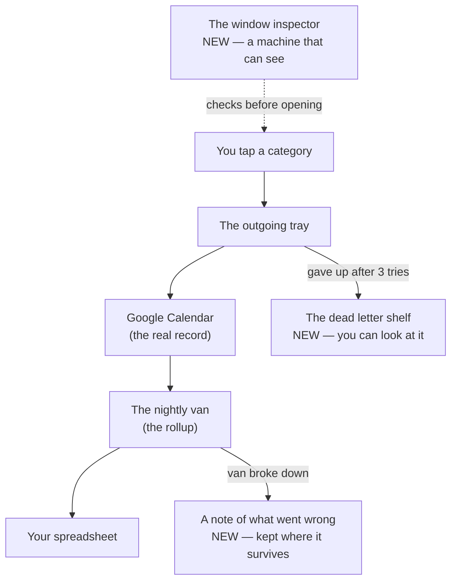
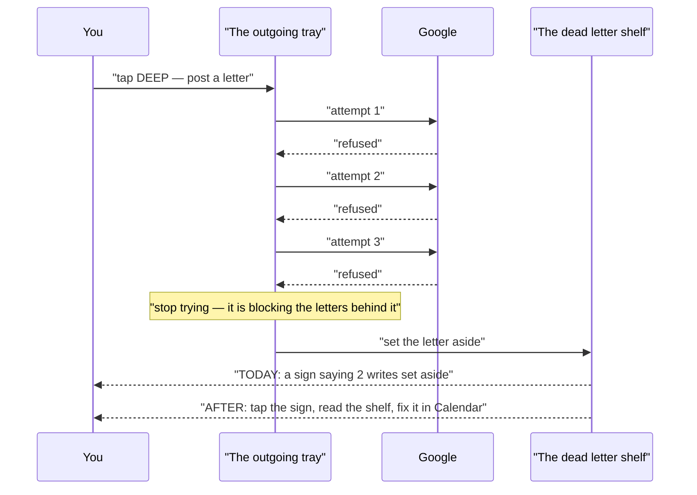
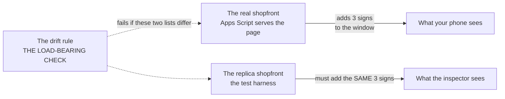

# timetap — the plain-language owner's manual

Written as we go, one section per checkpoint. Pictures first, analogies always,
no jargon that isn't explained in the same sentence.

---

# Part 1 — The plan, explained

## What we're about to build
*2026-07-26 — before any code is written*

### The whole thing in one picture

The scene for this whole explanation is **a small post office**. Every tap you
make in the app is a letter you're posting. Keep that one picture in your head
and everything below fits into it.

Three of those boxes are new. Everything else already exists and works.

### The cast of characters

**You tap a category** — the front counter. This is the app on your phone,
[Index.html](../Index.html). Nothing about this changes in this round. Tapping
still opens a block, the next tap still closes it, the mark still appears.

**The outgoing tray** — where a letter waits to be delivered. When you tap, the
screen updates immediately and the actual write to Google happens a moment later
in the background. If Google can't be reached, the letter waits in the tray and
gets tried again. This is the "queue" in [Index.html:408](../Index.html:408), and
it already works well.

**Google Calendar** — the ledger of record. Not a copy, not a backup: *the*
record. Your phone's memory is just a tray of letters on their way there. This is
why the app survives a dead battery — on startup it asks the calendar what's open
rather than trusting the phone.

**The dead letter shelf** *(new — Stage B)* — where undeliverable mail goes.
Today, a letter that fails three times is taken out of the tray and put somewhere
you cannot see, and a sign appears saying "2 writes were set aside"
([Index.html:964](../Index.html:964)). That's the whole story you currently get.
We're turning that hidden pile into a shelf you can walk over to and read: when,
which category, what it was trying to do, and why it failed.

**The nightly van** *(gets a repair — Stage C)* — the rollup, a job that runs once
a day, reads the calendars, and rewrites two tabs of your spreadsheet
([Code.gs:817](../Code.gs:817)). You read those on Sunday. Today, if the van
breaks down, nobody tells you and nothing looks different — the spreadsheet just
quietly holds last week's numbers.

**A note of what went wrong** *(new — Stage C)* — the van's logbook. Two parts:
the van writes today's date onto the ledger every time it makes a delivery, and it
keeps a private note of any breakdown somewhere that survives even when it can't
reach the ledger at all.

**The window inspector** *(new — Stage D)* — someone who checks the shopfront
looks right before opening. Right now the only person who can do that is you,
walking past with your own eyes: [test/smoke.js](../test/smoke.js) is a file you
paste into a browser by hand, on your phone. It catches things nothing else can —
text laid on top of other text, the page being taller than the screen — but only
if a human does it. We're hiring a machine that can look.

### Follow one letter through the system

The spine of this round is the story of a letter that never arrives. Here's what
happens today, and what will happen after.

The key moment is the one labelled *stop trying*. The tray delivers letters in
order, so a letter that can't go anywhere blocks every letter behind it. Setting
it aside is the right call — that part already works and we're not touching it.
The problem is purely that the shelf has no door.

**Why there's no "try again" button.** This surprised me while reading the code,
and it's the most interesting decision in the round. By the time a letter reaches
the shelf, it sat at the front of the tray while every letter behind it went
through. So the world has moved on: if the failed letter was the one saying *"open
a DEEP block at 2:15"*, then the later letter saying *"close that block at 3:40"*
already went out and referred to a block that never existed. Posting the first
letter now, out of order, wouldn't repair anything — it would be the app guessing
what you meant. Your calendar is right there and you can fix it in ten seconds by
hand. The shelf's job is to tell you *where to look*, which is the one thing you
currently can't find out.

### The window inspector, and the one thing that could make it a lie

Here's the wrinkle. When Google serves your app, it doesn't just hand over
[Index.html](../Index.html) — it adds three instructions to the page on the way out
([Code.gs:176](../Code.gs:176)), one of which is what tells a phone how wide the
screen is. Those instructions aren't in the file. They're added in transit.

So an inspector looking at the file on disk is looking at a page your phone never
receives. The fix is to have the replica add the same three instructions before the
inspector looks.

Which creates the real danger: **the day someone changes the three signs in the
real shopfront and forgets the replica.** From then on the inspector is checking a
building that doesn't exist, and passing it, and everyone feels safe. That's what
the drift rule is for — one check whose entire job is to fail the moment those two
lists stop matching. It's marked the highest-risk task in the plan
([D4](PLAN.md)), not because it's hard, but because a check like that is very easy
to write in a way that can never fail, and a check that can never fail is worse
than no check at all — because it gets counted.

### The parts most likely to confuse you

**1. Almost none of this code ever runs.** Every feature in this round lives on
what's called an error path — code that only wakes up after something has already
gone wrong. You could use the app happily for a month and never see the shelf, the
van's logbook, or the inspector's report. That's what makes it dangerous to build:
normal use won't reveal a mistake. It's also exactly why the next stage
(`factory-tests`) will deliberately break things — a Google that always refuses, a
spreadsheet that can't be opened, two tag lists knocked out of sync — rather than
watching it work and assuming the rest.

**2. The machine inspector does not replace you with your phone.** A headless
browser on a Mac is not an iPhone. Two of the three bug classes
[test/smoke.js](../test/smoke.js) was written for *only ever appeared on the
phone*. The paste-into-your-phone step stays in the instructions, unchanged, and
the plan explicitly forbids deleting it.

**3. "No dependencies" stops being strictly true, and we say so.** The app's
README opens by boasting that it has no dependencies — nothing borrowed from
anyone else. The inspector needs a borrowed browser. That borrowed thing never
touches the four files that run on your phone; it only ever runs on your Mac,
before a deploy. But the sentence in the README would quietly become false, so
there's a task at the end of the plan ([E1](PLAN.md)) to restate it honestly
rather than leave a boast that's aged badly.

### What you can now say

Three sentences that are accurate, if you ever need to explain this round to
someone technical:

1. "Every feature in this round is on an error path, so the tests have to force
   the failures — a server that always rejects, a sheet that won't open, a
   deliberately desynchronised tag list — rather than observe the happy path."
2. "The dead-letter drawer deliberately has no retry, because a quarantined
   operation sat at the head of an ordered queue while everything behind it
   proceeded, so replaying it out of order would be inference, not recovery."
3. "The headless smoke test renders locally, which is only honest because a lint
   rule fails the moment the harness's injected meta tags drift from the ones
   `doGet` actually serves."
